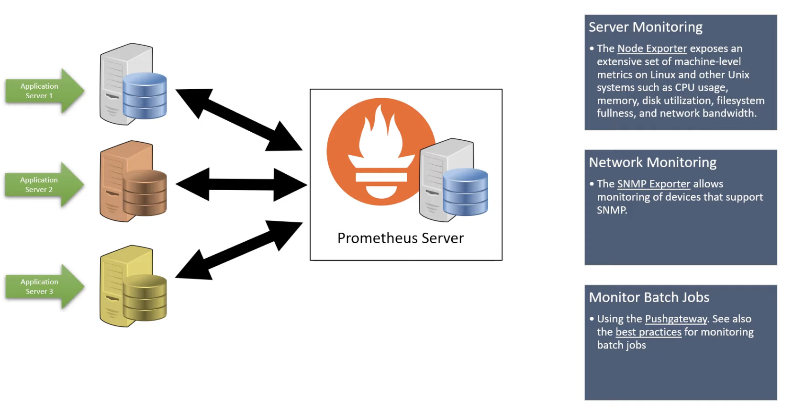
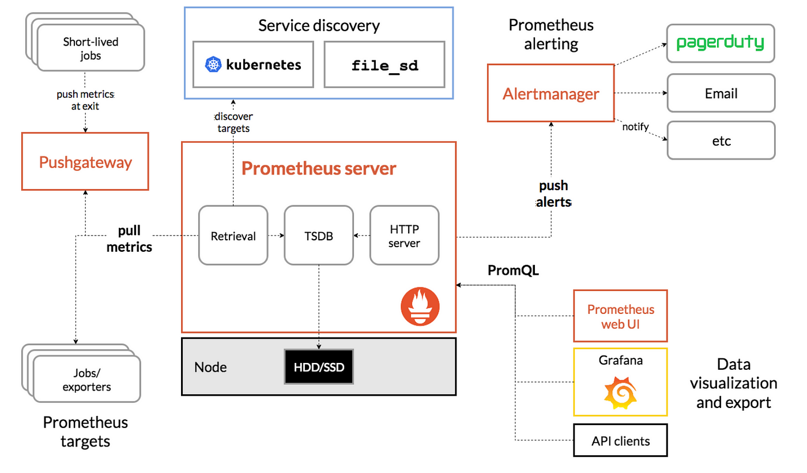

## We are watching don't worry  

---
# The Observation , Monitoring and alerting Engine 

 Prometheus is a free software application used for event monitoring and alerting. It records metrics in a time series database built using an HTTP pull model, with flexible queries and real-time alerting 

### General Info
<ol>
    <li> Open Source product </li>
    <li> Written in Golang  </li>
    <li> Originally Developed at SoundClound in 2012  </li>
    <li> Now CNCF is taking care  </li>
    <li> Prometheus is inspired by Google's Borgmon </li>

</ol>

## Prometheus Monitoring 

As Seen in above picture it can monitoring <b> Server | Network | Database | Applications | Batch jobs | Containers  </b>  and many more 

 

### Architecture and Components 

### Components 

### The Prometheus ecosystem consists of multiple components, many of which are optional:
<ol>
 <li>the main Prometheus server which scrapes and stores time series data </li>
<li>client libraries for instrumenting application code </li>
<li> a push gateway for supporting short-lived jobs</li>
<li> special-purpose exporters for services like HAProxy, StatsD, Graphite, etc.</li>
<li> an alertmanager to handle alerts</li>
<li> various support tools </li> 
</ol>
