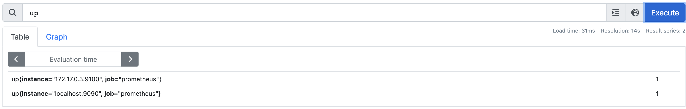
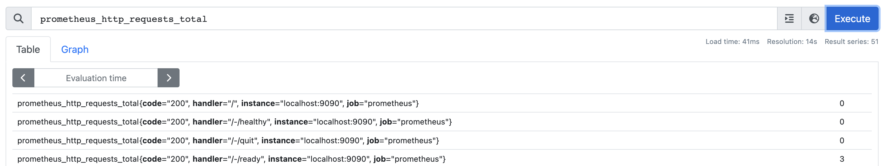
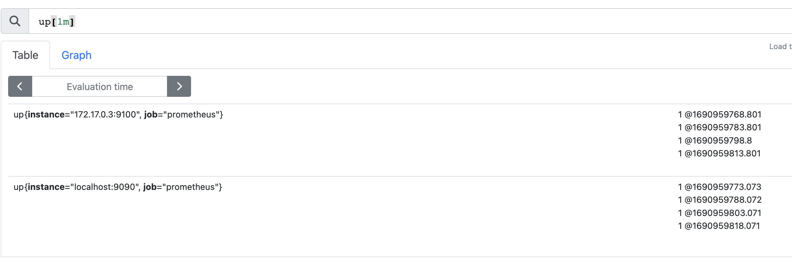
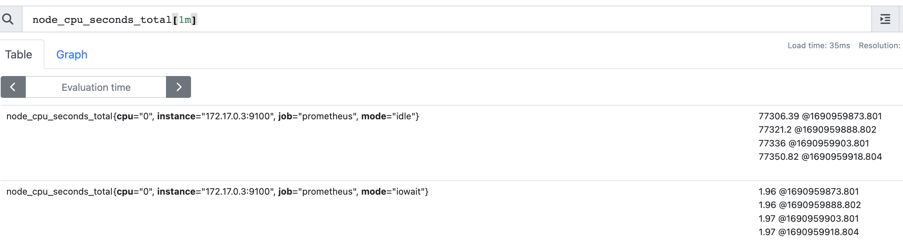

## We are watching don't worry  
---
### PromQL 

<pre>
  Prometheus PromQL (Prometheus Query Language) is a query language used to retrieve and manipulate time-series data from Prometheus
</pre>

<b> This is SQL like Language to fetch data using Query from Prometheus TSDB </b>

## Data types in PromQL  

### Info 
<pre>
Expression language data types
In Prometheus's expression language, an expression or sub-expression can evaluate to one of four types:
</pre>
<ul> 
<li> Instant vector - a set of time series containing a single sample for each time series, all sharing the same timestamp </li>  
<li> Range vector - a set of time series containing a range of data points over time for each time series </li> 
<li> Scalar - a simple numeric floating point value </li> 
<li> String - a simple string value; currently unused </li> 
</ul>

## Instant Vetctor 

 It is Going to have A single value as output for every query 

## Examples 

### Up 

### prometheus_http_requests_total

## Range vector

 For Individual Query we can get Multiple values like shown below 

###  Examples 

## up[1m]

### node_cpu_seconds_total[1m]

