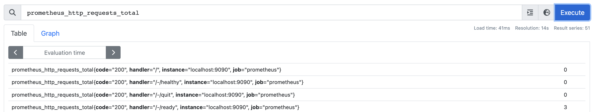
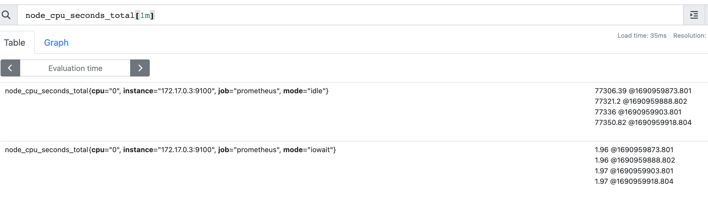
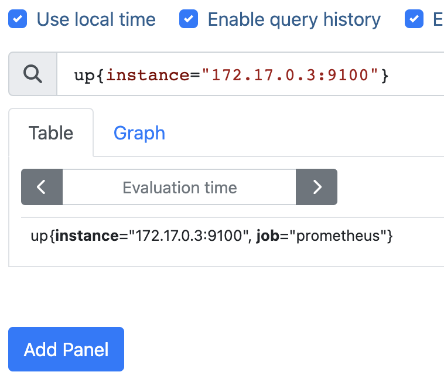

## We are watching don't worry  
---
### PromQL 

<pre>
  Prometheus PromQL (Prometheus Query Language) is a query language used to retrieve and manipulate time-series data from Prometheus
</pre>

<b> This is SQL like Language to fetch data using Query from Prometheus TSDB </b>

## Data types in PromQL  

### Info 
<pre>
Expression language data types
In Prometheus's expression language, an expression or sub-expression can evaluate to one of four types:
</pre>
<ul> 
<li> Instant vector - a set of time series containing a single sample for each time series, all sharing the same timestamp </li>  
<li> Range vector - a set of time series containing a range of data points over time for each time series </li> 
<li> Scalar - a simple numeric floating point value </li> 
<li> String - a simple string value; currently unused </li> 
</ul>

## Instant Vetctor 
<p> It is Going to have A single value as output for every query </p>

## Examples 

### Up 


### prometheus_http_requests_total



## Range vector

<p> For Individual Query we can get Multiple values like shown below </p>

###  Examples 

## up[1m]


### node_cpu_seconds_total[1m]




## Matchers & Selectors 

### selectors 

```
=: Select labels that are exactly equal to the provided string.
!=: Select labels that are not equal to the provided string.
=~: Select labels that regex-match the provided string.
!~: Select labels that do not regex-match the provided string.
```

### Example query 



### Range Vector Time Division 

```
Time durations are specified as a number, followed immediately by one of the following units:

ms - milliseconds
s - seconds
m - minutes
h - hours
d - days - assuming a day has always 24h
w - weeks - assuming a week has always 7d
y - years - assuming a year has always 365d
```

### Aggregation operator 

```
Aggregation operators
Prometheus supports the following built-in aggregation operators that can be used to aggregate the elements of a single instant vector, resulting in a new vector of fewer elements with aggregated values:

sum (calculate sum over dimensions)
min (select minimum over dimensions)
max (select maximum over dimensions)
avg (calculate the average over dimensions)
group (all values in the resulting vector are 1)
stddev (calculate population standard deviation over dimensions)
stdvar (calculate population standard variance over dimensions)
count (count number of elements in the vector)
count_values (count number of elements with the same value)
bottomk (smallest k elements by sample value)
topk (largest k elements by sample value)
quantile (calculate φ-quantile (0 ≤ φ ≤ 1) over dimensions)
```

## Examples of Aggregation operators

### prometheus internal http request (total count)

```
sum(prometheus_http_requests_total)
```

### Sum by http status code 

```
sum(prometheus_http_requests_total) by (code)
```

### node cpu mode

```
sum(node_cpu_seconds_total) by (mode)
```

### cpu -- top 3 status of mode 

```
topk(3,sum(node_cpu_seconds_total) by (mode))
```

### lowest 3
