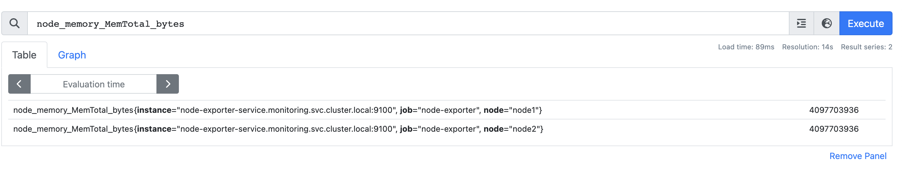

# Prometheus Node Exporter

Prometheus Node Exporter is a tool designed for collecting and exposing system metrics from a target machine. It is a crucial part of the Prometheus monitoring and alerting ecosystem, providing insights into the health and performance of infrastructure components.

## What is Prometheus?

[Prometheus](https://prometheus.io/) is an open-source monitoring and alerting toolkit known for its reliability and scalability. It collects metrics from configured targets, stores them, and makes them available for querying and alerting.

## What is Node Exporter?

Prometheus Node Exporter is a Prometheus exporter specifically designed for hardware and operating system metrics. It operates as a daemon on the target machine, collecting metrics such as CPU usage, memory, disk usage, and network statistics.

## Metrics Exposed by Node Exporter

Node Exporter exposes a wide range of metrics, including:

- CPU usage (per core)
- Memory usage
- Disk usage (per mount point)
- Network statistics
- Filesystem information
- Uptime
- Load averages
- And various other system-level metrics

## How Node Exporter Works

Node Exporter periodically collects system-level metrics from the target machine. Prometheus scrapes these metrics from the Node Exporter's HTTP endpoint, and the collected data is stored in Prometheus' time-series database.

## Setting Up Node Exporter

To use Node Exporter, you need to install and configure it on the target machines. Node Exporter is typically started as a service or daemon on the target system. Prometheus is then configured to scrape metrics from the Node Exporter's endpoint.

## Integration with Prometheus

In the Prometheus configuration, specify the targets (machines with Node Exporter) that Prometheus should scrape. This is done through the `scrape_configs` section in Prometheus' configuration file.

## Visualization and Alerting

Use tools like [Grafana](https://grafana.com/) to visualize the collected metrics. Grafana allows you to create dashboards displaying various metrics over time. Prometheus also supports alerting based on defined rules, enabling proactive issue management.

## Use Cases

Node Exporter is valuable for monitoring the health and performance of servers, containers, and virtual machines. It provides insights into resource utilization and system behavior.

---
**Note:** Ensure proper installation and configuration of both Prometheus and Node Exporter for effective monitoring.

## PromQL for node-exporter

### my k8s cluster is 

```
k8s_deploy kubectl get no
NAME     STATUS   ROLES           AGE    VERSION
master   Ready    control-plane   138m   v1.28.2
node1    Ready    <none>          137m   v1.28.2
node2    Ready    <none>          137m   v1.28.2
```

##  Using promQL 

### PROMQL -- Total RAM 

```
node_memory_MemTotal_bytes
```

### Response 



### RAM in MB and GB for node1 

```
node_memory_MemTotal_bytes / 1024 / 1024  # in MB 
```

### for Node1 only 

```
node_memory_MemTotal_bytes{node='node1'} / 1024 / 1024 
```

### Free Memory 

```
node_memory_MemFree_bytes / 1024 / 1024
```

### used RAM 

```
((node_memory_MemAvailable_bytes) - (node_memory_MemFree_bytes)) / 1024 / 1024
```

## CPU related metrics 

### CPU load average 

```
node_load1

```

### number of cpu core 

```
count without(cpu, mode) (node_cpu_seconds_total{mode="idle"})
```

### CPU usage overall percentage 

```
100 - (avg(irate(node_cpu_seconds_total{mode="idle"}[5m])) * 100)

```


