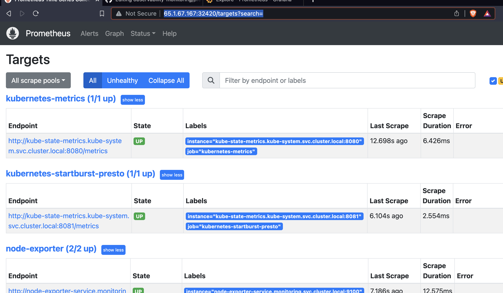

## To Deploy/install prometheus & grafana in any k8s cluster manually 

### using kubectl 

```
 manual git:(master) ✗ kubectl apply -f  yamls


configmap/prometheus-configmap unchanged
deployment.apps/prometheus-deployment unchanged
deployment.apps/grafana unchanged
service/ui-grafana configured
daemonset.apps/node-exporter unchanged
service/node-exporter-service unchanged
service/prom-server configured


➜  manual git:(master) ✗ 
```

### Verify 

```
  manual git:(master) ✗ kubectl  get  deploy
NAME                    READY   UP-TO-DATE   AVAILABLE   AGE
grafana                 1/1     1            1           26m
prometheus-deployment   1/1     1            1           21h
➜  manual git:(master) ✗ 
➜  manual git:(master) ✗ kubectl  get  ds    
NAME            DESIRED   CURRENT   READY   UP-TO-DATE   AVAILABLE   NODE SELECTOR   AGE
node-exporter   2         2         2       2            2           <none>          22h
➜  manual git:(master) ✗ 
➜  manual git:(master) ✗ kubectl  get  cm 
NAME                   DATA   AGE
kube-root-ca.crt       1      23h
prometheus-configmap   1      22h
➜  manual git:(master) ✗ 
➜  manual git:(master) ✗ kubectl  get  svc
NAME                    TYPE        CLUSTER-IP       EXTERNAL-IP   PORT(S)          AGE
node-exporter-service   ClusterIP   10.102.245.125   <none>        9100/TCP         22h
prom-server             NodePort    10.111.90.131    <none>        9090:32420/TCP   23h
ui-grafana              NodePort    10.105.184.142   <none>        3000:32409/TCP   25m
➜  manual git:(master) ✗ 
```

## Configure Prometheus to monitoring kuberentes pods and other metrics using kube-metrics 

### CLone project 
```
git clone https://github.com/kubernetes/kube-state-metrics.git
Cloning into 'kube-state-metrics'...
remote: Enumerating objects: 29275, done.
remote: Counting objects: 100% (1060/1060), done.
remote: Compressing objects: 100% (586/586), done.
remote: Total 29275 (delta 643), reused 780 (delta 458), pack-reused 28215
Receiving objects: 100% (29275/29275), 22.30 MiB | 6.90 MiB/s, done.
Resolving deltas: 100% (18769/18769), done.

====>
➜   ls

        kube-state-metrics   node-exp-svc.yaml
```

### Deploy it 

```
 kubectl  apply -f  kube-state-metrics/examples/standard

clusterrolebinding.rbac.authorization.k8s.io/kube-state-metrics created
clusterrole.rbac.authorization.k8s.io/kube-state-metrics created
deployment.apps/kube-state-metrics created
serviceaccount/kube-state-metrics created
service/kube-state-metrics created
```

### Verify 

```
 manual git:(master) kubectl  get  clusterrole  | grep kube-state       
kube-state-metrics                                                     2023-10-04T04:27:52Z
➜  manual git:(master) 
➜  manual git:(master) kubectl  get  clusterrolebinding  | grep kube-state
kube-state-metrics                                     ClusterRole/kube-state-metrics                                                     14m
➜  manual git:(master) 
➜  manual git:(master) 
➜  manual git:(master) kubectl get  deploy -A  | grep kube-state          
kube-system   kube-state-metrics        1/1     1            1           14m
➜  manual git:(master) 
➜  manual git:(master) kubectl get  sa  -A  | grep kube-state
kube-system       kube-state-metrics                   0         14m
➜  manual git:(master) 
➜  manual git:(master) kubectl get  svc  -A  | grep kube-state
kube-system   kube-state-metrics      ClusterIP   None             <none>        8080/TCP,8081/TCP        15m
➜  manual git:(master) 

```


## Updating configmap of prometheus and rolling out prometheus deployment 

### yamls/cm.yaml 

```
apiVersion: v1
kind: ConfigMap
metadata:
  name: prometheus-configmap
data:
  prometheus.yml: |
    global:
      scrape_interval: 15s

    scrape_configs:
      - job_name: 'prometheus'
        static_configs:
          - targets: ['prom-server:9090']
# adding k8s part 
      - job_name: 'kubernetes-metrics'
        static_configs:
          - targets: ['kube-state-metrics.kube-system.svc.cluster.local:8080']
# adding k8s part 
      - job_name: 'kubernetes-startburst-presto'
        static_configs:
          - targets: ['kube-state-metrics.kube-system.svc.cluster.local:8081']
      - job_name: 'node-exporter'
        static_configs:
          - targets: ['node-exporter-service.monitoring.svc.cluster.local:9100']
            labels:
              node: node1
          - targets: ['node-exporter-service.monitoring.svc.cluster.local:9100']
            labels:
              node: node2
```

### apply changes in CM

```
kubectl apply -f cm.yaml
```

### rolling out deployment 

```
kubectl rollout restart deployment prometheus-deployment
```

### verify changes 

```
 prom-data kubectl get po                                                
NAME                                     READY   STATUS    RESTARTS   AGE
grafana-54b495b5d8-7ktp5                 1/1     Running   0          50m
node-exporter-7m55f                      1/1     Running   0          23h
node-exporter-jbwm5                      1/1     Running   0          23h
prometheus-deployment-6cfcbcf5d7-kw5x4   1/1     Running   0          4m38s
➜  prom-data 
➜  prom-data 
➜  prom-data kubectl  exec -it prometheus-deployment-6cfcbcf5d7-kw5x4 -- cat  /etc/prometheus/prometheus.yml
global:
  scrape_interval: 15s

scrape_configs:
  - job_name: 'prometheus'
    static_configs:
      - targets: ['prom-server:9090']
  - job_name: 'kubernetes-metrics'
    static_configs:
      - targets: ['kube-state-metrics.kube-system.svc.cluster.local:8080']
  - job_name: 'kubernetes-startburst-presto'
    static_configs:
      - targets: ['kube-state-metrics.kube-system.svc.cluster.local:8081']
  - job_name: 'node-exporter'
    static_configs:
      - targets: ['node-exporter-service.monitoring.svc.cluster.local:9100']
        labels:
          node: node1
      - targets: ['node-exporter-service.monitoring.svc.cluster.local:9100']
        labels:
          node: node2
```

### you can also verify from prometheus GUI -- by access the status -- > target section 



